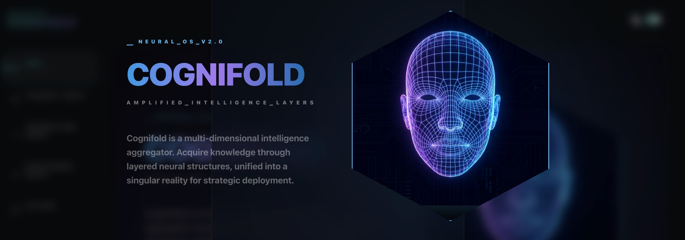
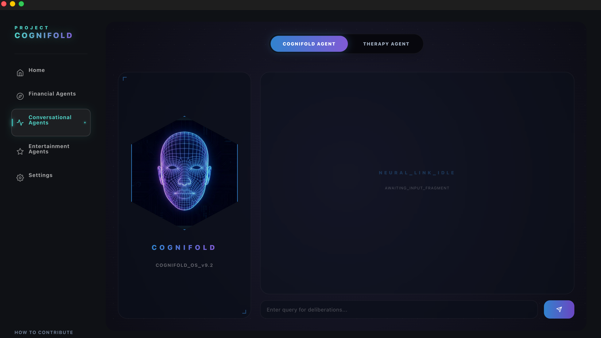
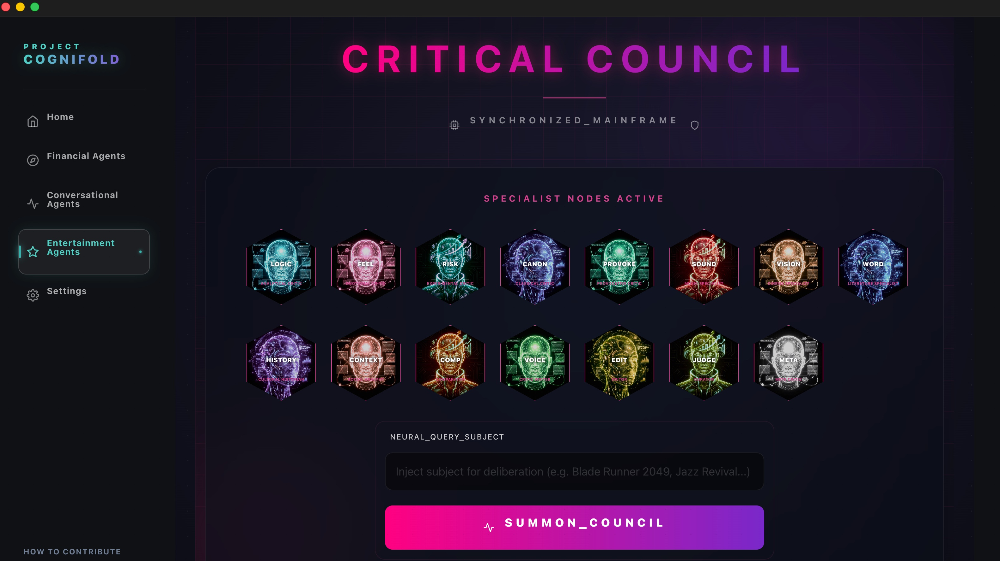
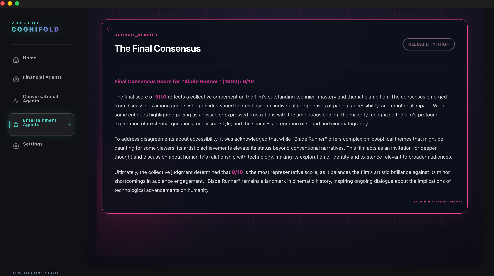
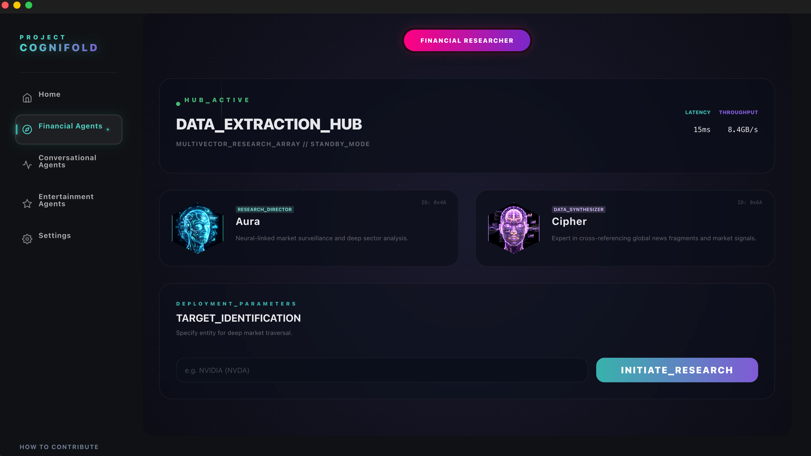
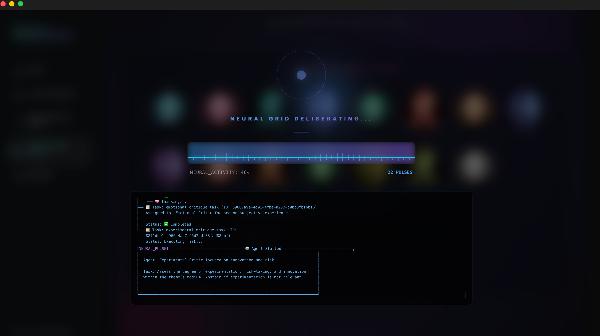
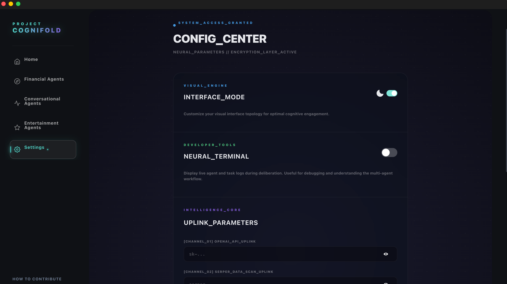
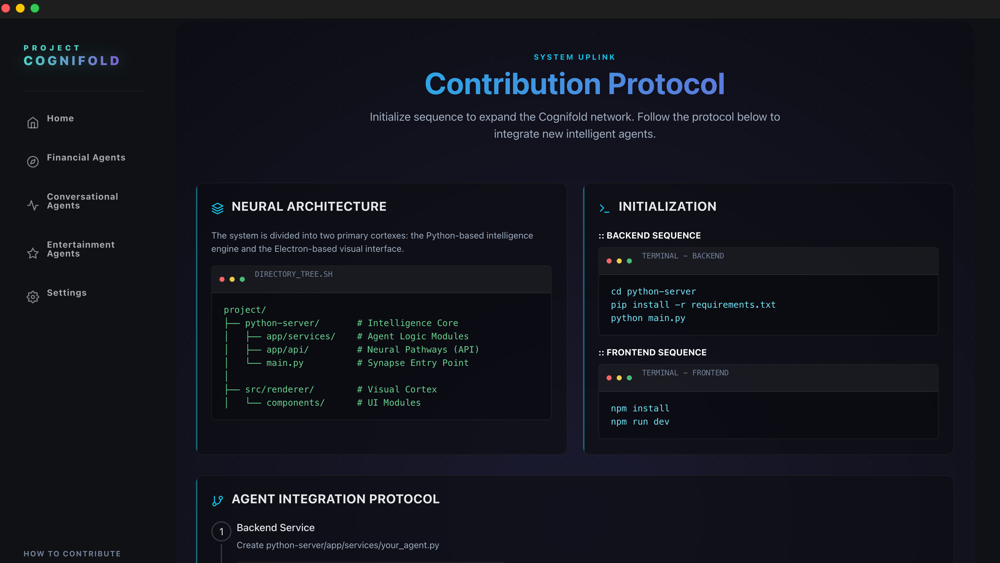

# Cognifold

> *"The interface between human intent and artificial execution."*

**Cognifold** is an **Agentic AI Agregator** designed to provide a unified, futuristic interface for managing specialized AI agents. Cognifold aggregates distinct "agentic workflows" from financial research to creative criticism into a cohesive, sci-fi inspired cockpit.

## 🌌 The Aesthetic: "Alien Innovation"
The UI is heavily inspired by **Ridley Scott's *Alien* (1979)** and **Cyberpunk culture**. It blends:
- **Retro-Futurism**: Scanlines, CRT effects, and monospaced typography.
- **Xenomorphic Design**: Organic curves meet industrial rigidity.
- **Ludic Labels**: System messages like *"NEURAL_LINK_STABLE"* immerse the user in a high-tech experience.

---

## 🏗️ Technical Architecture

Cognifold is a hybrid **Electron + Python** application, combining the responsive UI of the web with the raw processing power of a native Python backend.

### The Stack
- **Frontend (The Visual Cortex)**: Built with **Electron**, **React**, and **Vite**. Styled using **Chakra UI** and **Framer Motion** for that fluid, futuristic feel.
- **Backend (The Intelligence Engine)**: A **FastAPI** server running locally, managing agent execution.
- **Orchestration**: **CrewAI** is used to manage multi-agent workflows (like the Critical Council).
- **Packaging**: The Python server is compiled into a standalone executable using **PyInstaller**, ensuring users don't need to manage Python environments manually.

---

## 🤖 System Modules

### 1. The Neural Core (Conversational Agents)


The primary interface for direct interaction.
- **Tech**: Uses Server-Sent Events (SSE) to stream real-time responses from the Python backend.
- **Context**: Can switch between multiple personas, including the default professional assistant and the **Therapy Agent** (Empathy Core).

### 2. The Critical Council (Review Specialists)



A sophisticated panel of AI critics that deconstruct artistic works.
- **Tech**: Utilizes **CrewAI** to coordinate 5 distinct critic agents (Analytical, Emotional, Experimental, Classical, Provocative) and specialized researchers.
- **Workflow**: The system takes a user's prompt, dispatches it to the crew, and aggregates their individual critiques into a final, polished editorial.

### 3. Financial Intelligence


A dedicated deep-dive agent for market analysis.
- **Tech**: Connects to external search tools to retrieve real-time market data, performing due diligence that goes beyond static training data.

### 4. Neural Debug Terminal


Real-time visualization of server activity during agent execution.
- **Tech**: Server-Sent Events (SSE) stream logs from the Python backend to the frontend in real-time.
- **Activation**: Enable "Show Terminal" in Settings to display live neural pulse activity and agent logs during execution.
- **Visualization**: Features a futuristic neural pulse visualizer that fluctuates based on log activity, providing visual feedback of the AI agents' processing state.

### 5. System Configuration


User preferences and system diagnostics.
- **Customization**: Toggle "Neural Terminal" logs, adjust API keys, and manage system resources.

### 6. Open Source Contribution


The app includes a built-in guide on how to extend the system.
- **Extensibility**: The modular architecture allows developers to drop in new Python services and React components with minimal friction.

---

## 🚀 Getting Started

1. **Clone the repository**
2. **Launch the System**:
   You can start the development environment with a single command. The system will automatically detect and install both frontend and backend dependencies on your first run:
   ```bash
   npm run dev
   ```

   > [!IMPORTANT]
   > On the **first execution**, the system will install all necessary nodes and set up the Python virtual environment. This process can take a few minutes depending on your connection. Subsequent starts will be nearly instantaneous.

---

## 🛠️ Troubleshooting: Copying the Project

If you copy or move this project to a new directory, the Python virtual environment (`python-server/venv`) will likely break due to hardcoded absolute paths. 

**The application is now configured to detect this and run the setup automatically** when you start with `npm run dev`. However, if you see persistent errors related to Python modules or "failed to start Python server", follow these manual steps:

1. **Delete the existing venv**:
   ```bash
   rm -rf python-server/venv
   ```
2. **Rebuild the server**:
   ```bash
   cd python-server
   ./build-server.sh
   ```
3. **Restart the app**:
   ```bash
   cd ..
   npm run dev
   ```

---

## Architecture & Contribution

We welcome contributions! If you want to add a new Agent or feature, please read our [Contribution Guide](CONTRIBUTING.md).

For deployment instructions and platform-specific builds, refer to the [Contributing Guide](CONTRIBUTING.md#deployment).

---


